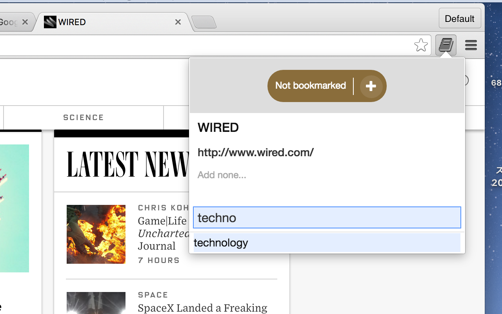

Bookmarks Extension for Google
==============================

(C)2015 WATANABE Takuma <takumaw@sfo.kuramae.ne.jp>

Bookmarks Extension for Google is a minimal, clean Chrome Extension for [Google Bookmarks](https://www.google.com/bookmarks/).

With this, you can add a page to Google Bookmarks simply by clicking the icon.

Screenshots
-----------

  

Install
-------

To install,

1. Download `src.crx`.
2. Open your Google Chrome's Extensions settings page.
3. Drag and drop `src.crx` to the page.
4. Press "Install" button.
5. That's it!

License
-------
Bookmarks Launcher, excluding the softwares and the icon from third-parties, is released under MIT License as provided in `LICENSE.txt`.

[jQuery](http://jquery.org/) is by jQuery Foundation, released under [MIT License](http://jquery.org/license/).

[Bootstrap](http://twitter.github.com/bootstrap/) is by @mdo and @fat, released under Apache License v2.0.

The icon is from [Font Awesome](http://fortawesome.github.com/Font-Awesome/) by Dave Gandy,
released under [CC BY 3.0 License](http://creativecommons.org/licenses/by/3.0/).
